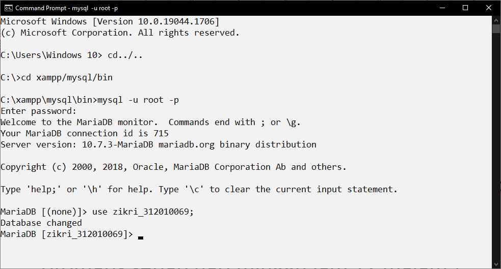
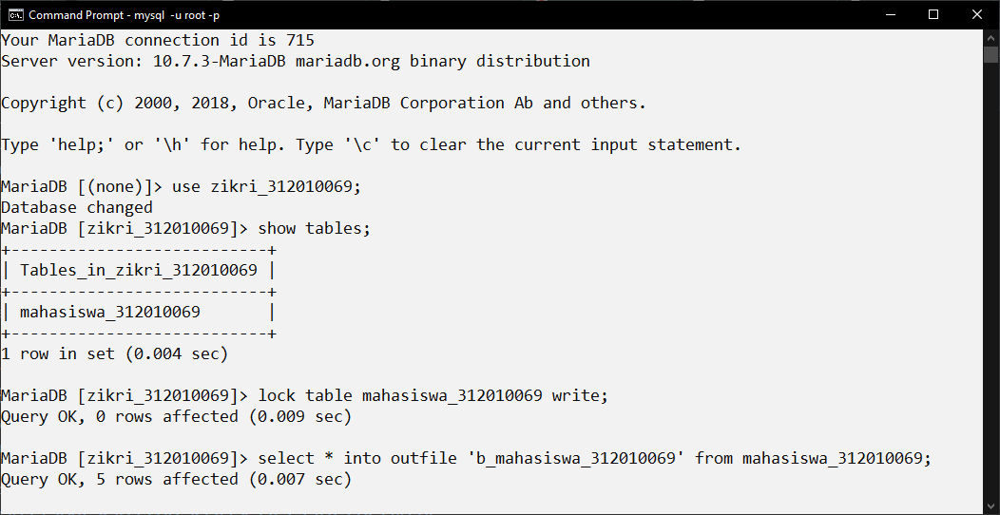
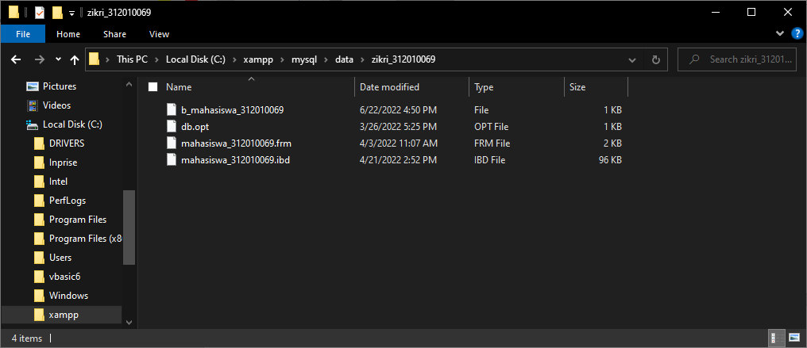
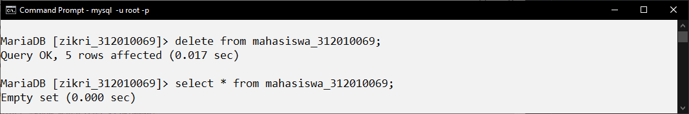
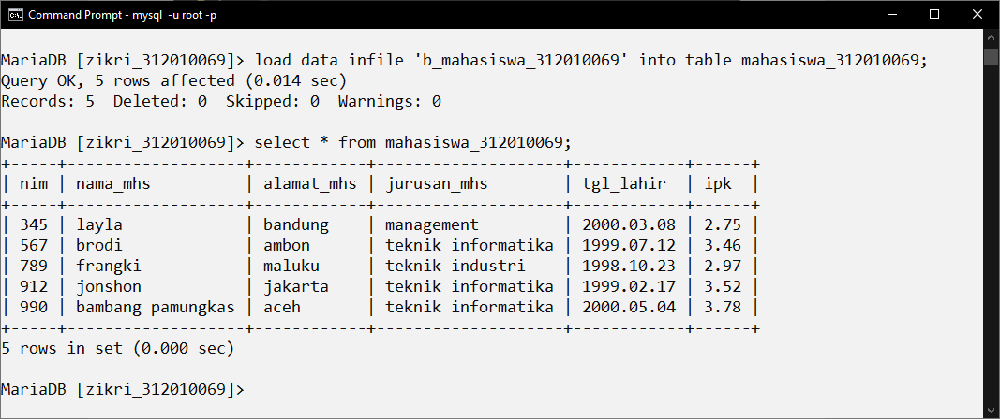
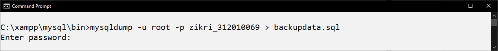
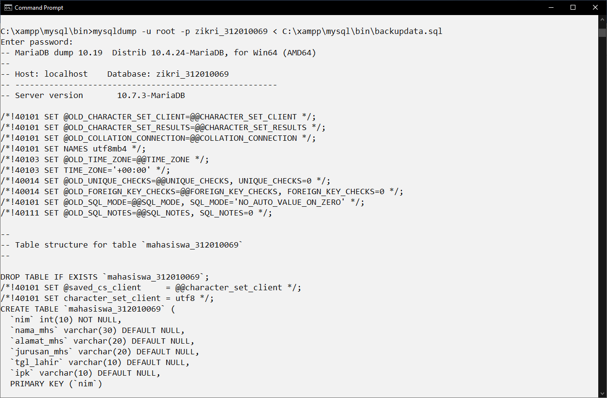
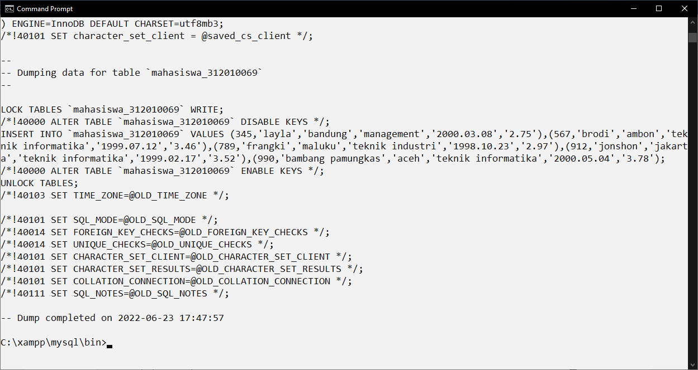

# TUGAS 6

- Nama : Zikri Hadiansyah
- Nim : 312010069
- Kelas : TI.20.D.1
- Matkul : Sistem Basis Data

# Soal

1. masuk ke database nama nim
2. lakukan proses backup dan recovery dengan sql
3. lakukan proses backup dan recovery dengan sqldump
4. tuliskan script cron job untuk melakukan backup otomatis setiap hari minggu jam 12 malam

# Jawaban

1. masuk ke database Zikri_312010069

2. lakukan proses backup dan recovery dengan sql

- proses backup :
  

- data backup terdapat pada file C:xampp\mysql\data\zikri_312010069
  

- proses recovery :

* pertama hapus tabel yang telah dibackup dan mencoba menampilkan tabel
  

* kemudian recovery tabel dan dicoba untuk menampilkan tabel
  

3. lakukan proses backup dan recovery dengan sqldump

- proses backup :
  

- proses recovery :
  

4. tuliskan script cron job untuk melakukan backup otomatis setiap hari minggu jam 12 malam

crontab –e

0 0 \* \* 7 myqldump -u root -p zikri_312010069 > mahasiswa_312010069_backupdata2.sql
